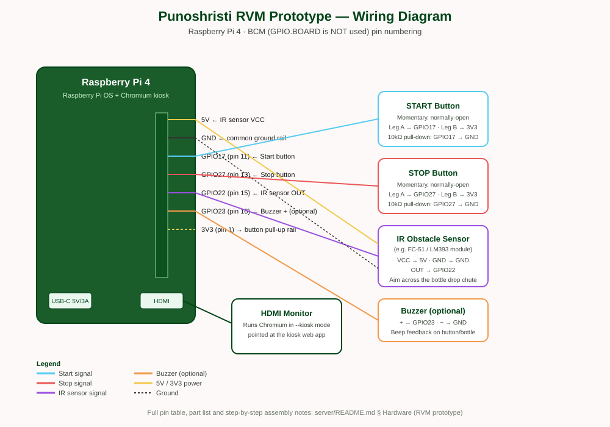

# বোতল ডিপোজিট সিস্টেম (Bottle Deposit / RVM System)

একটি লোকাল-নেটওয়ার্ক প্রজেক্ট যা প্লাস্টিক বোতল রিসাইক্লিং/ডিপোজিট মেশিন (Reverse Vending Machine — RVM)-কে ডিজিটাইজ করে: মেশিনে বোতল জমা দিলে একটি **এক-বার-ব্যবহারযোগ্য (single-use) QR কোড** তৈরি হয়, এবং ব্যবহারকারী তার ফোনের ব্রাউজার দিয়ে সেই QR কোড স্ক্যান করলে তার অ্যাকাউন্টে **Eco-Points** ও বোতল সংখ্যা **রিয়েল-টাইমে** যোগ হয়ে যায় — যা পরে পার্টনার দোকান/ক্যাফেতে রিডিম করা যায়।

সিস্টেমটি দুইভাবে চালানো যায়:
- **ম্যানুয়াল মোড** — একজন অপারেটর ল্যাপটপ/ট্যাবে বোতলের সংখ্যা টাইপ করে QR তৈরি করেন (টেস্টিং/ডেমোর জন্য সুবিধাজনক)।
- **হার্ডওয়্যার মোড (RVM প্রোটোটাইপ)** — একটি Raspberry Pi + IR সেন্সর + Start/Stop বাটন দিয়ে বোতল স্বয়ংক্রিয়ভাবে গণনা হয়, মনিটরে অলস সময়ে বিজ্ঞাপন/ভিডিও চলতে থাকে, এবং Stop চাপলেই QR কোড দেখায়। বিস্তারিত: [হার্ডওয়্যার প্রোটোটাইপ (RVM মেশিন)](#হার্ডওয়্যার-প্রোটোটাইপ-rvm-মেশিন)।

এই রিপোজিটরিতে পাঁচটি সাব-প্রজেক্ট আছে:

| ফোল্ডার | বিবরণ | পোর্ট | স্ট্যাক |
| --- | --- | --- | --- |
| [`backend/`](backend/) | কেন্দ্রীয় API সার্ভার — ইউজার, সেশন/QR, পয়েন্ট/লিডারবোর্ড, পার্টনার/রিডেম্পশন, বিজ্ঞাপন আপলোড, JWT অথেনটিকেশন এবং Socket.IO রিয়েল-টাইম ইভেন্ট। JSON ফাইল ডাটাবেজ (`lowdb`) ব্যবহার করে। | `4000` | Node.js, Express, lowdb, Socket.IO, multer |
| [`web/`](web/) | **মেশিনের স্ক্রিন (কিয়স্ক)** — মেশিনের গায়ে লাগানো মনিটরে চলে। অলস অবস্থায় বিজ্ঞাপন/ভিডিও লুপ চালায়; Start চাপলে (হার্ডওয়্যার বাটন বা অন-স্ক্রিন) গণনা শুরু হয়, Stop চাপলে QR কোড দেখায়। GPIO bridge না থাকলে ম্যানুয়াল বাটন দিয়েও কাজ করে। | `5173` | React 19, Vite, socket.io-client, qrcode.react |
| [`user-web/`](user-web/) | **ব্যবহারকারীর মোবাইল ওয়েব অ্যাপ** — রেজিস্ট্রেশন + ফোন OTP ভেরিফিকেশন, ড্যাশবোর্ড, QR স্ক্যান, মানচিত্রে RVM খোঁজা, পার্টনার অফার রিডিম, লিডারবোর্ড, প্রোফাইল। | `5181` (HTTPS) | React 19, Vite, Tailwind, react-leaflet, html5-qrcode, socket.io-client |
| [`admin/`](admin/) | **অ্যাডমিন প্যানেল** — ইউজার/মেশিন/স্ক্যান/পার্টনার/বিজ্ঞাপন ব্যবস্থাপনা, ক্যাপাসিটি অ্যালার্ট। | `5173` (ভিন্ন dev session) | React 19, Vite |
| [`kiosk-gpio-bridge/`](kiosk-gpio-bridge/) | **হার্ডওয়্যার ড্রাইভার** — Raspberry Pi-তে নেটিভভাবে চলে, GPIO থেকে Start/Stop বাটন ও IR সেন্সর পড়ে, লোকাল WebSocket দিয়ে `web` কিয়স্ককে জানায়। Pi ছাড়া অন্য কম্পিউটারে চালালে স্বয়ংক্রিয়ভাবে কীবোর্ড-সিমুলেটর মোডে চলে যায়। | `5055` (localhost-only) | Node.js, onoff, socket.io |
| [`mobile/`](mobile/) | **(বর্তমানে খালি/আনইউজড)** — পূর্বে এখানে একটি Expo (React Native) অ্যাপ ছিল। নিচের নোট দেখুন। | — | — |

> **নোট — `mobile/` সম্পর্কে:** আগে এই সিস্টেমের জন্য একটি Expo (React Native) মোবাইল অ্যাপ ছিল, কিন্তু Windows-এ লোকাল বিল্ডের জটিলতার কারণে সেটি সরিয়ে ফেলা হয়েছে। এর পরিবর্তে `user-web` ব্যবহৃত হয় — কোনো অ্যাপ ইনস্টলের দরকার নেই।

---

## সূচিপত্র

- [আর্কিটেকচার ও ডেটা ফ্লো](#আর্কিটেকচার-ও-ডেটা-ফ্লো)
- [প্রজেক্ট স্ট্রাকচার](#প্রজেক্ট-স্ট্রাকচার)
- [পূর্বশর্ত (Prerequisites)](#পূর্বশর্ত-prerequisites)
- [চালু করার ধাপ](#চালু-করার-ধাপ)
- [এনভায়রনমেন্ট ভেরিয়েবল](#এনভায়রনমেন্ট-ভেরিয়েবল)
- [ফিচার তালিকা](#ফিচার-তালিকা)
- [ব্যবহারের ধারা (Workflow)](#ব্যবহারের-ধারা-workflow)
- [ডাটা মডেল (lowdb / `db.json`)](#ডাটা-মডেল-lowdb--dbjson)
- [Backend API রেফারেন্স](#backend-api-রেফারেন্স)
- [Real-time ইভেন্ট (Socket.IO)](#real-time-ইভেন্ট-socketio)
- [QR কোড পেলোড ফরম্যাট](#qr-কোড-পেলোড-ফরম্যাট)
- [হার্ডওয়্যার প্রোটোটাইপ (RVM মেশিন)](#হার্ডওয়্যার-প্রোটোটাইপ-rvm-মেশিন)
- [প্রযুক্তি স্ট্যাক — বিস্তারিত](#প্রযুক্তি-স্ট্যাক--বিস্তারিত)
- [ট্রাবলশুটিং](#ট্রাবলশুটিং)
- [নিরাপত্তা সংক্রান্ত নোট](#নিরাপত্তা-সংক্রান্ত-নোট)
- [ভবিষ্যতে উন্নয়নের সম্ভাবনা](#ভবিষ্যতে-উন্নয়নের-সম্ভাবনা)

---

## আর্কিটেকচার ও ডেটা ফ্লো

```
                     ┌─────────────────────────────┐
   বিজ্ঞাপন আপলোড     │                             │   বোতল/পয়েন্ট/মেশিন ডাটা
  ┌───────────────┐  │                             │  ┌──────────────────────┐
  │  admin panel  │─▶│                             │─▶│  users, sessions,     │
  │  (5173)       │  │                             │  │  machines, scans,     │
  └───────────────┘  │        backend (4000)       │  │  partners,            │
                      │   Express + Socket.IO       │  │  redemptions, ads,    │
  ┌───────────────┐  │   + lowdb (db.json)          │  │  notifications        │
  │ kiosk-gpio-   │  │                             │  └──────────────────────┘
  │ bridge (5055) │  │                             │
  │ (Pi hardware) │  │                             │
  └──────┬────────┘  └───────────────┬─────────────┘
         │ local WebSocket           │ POST /api/sessions
         │ (start/stop/bottle)       │ { session, qrDataUrl }
         ▼                           │
  ┌───────────────┐                  │
  │ web — কিয়স্ক   │◀─────────────────┘
  │ স্ক্রিন (5173)  │
  │ ads → counting│      POST /api/scan { token }         ┌─────────────────┐
  │ → QR দেখায়    │─── QR স্ক্যান হলে ─────────────────────▶│ user-web (5181) │
  └───────────────┘                                        │ (ফোন/ব্রাউজার)   │
                                                             └────────┬────────┘
                                                                      │ socket.io-client
                                          ◀── "bottle-count-updated" / "points-updated" ──┘
                                              (room: user:<userId>)
```

**ধাপে ধাপে (হার্ডওয়্যার মোডে):**
1. মেশিন অলস অবস্থায় `web` কিয়স্ক স্ক্রিনে `GET /api/ads` থেকে আনা বিজ্ঞাপন/ভিডিও লুপ চলতে থাকে।
2. ব্যবহারকারী **Start** বাটন চাপে (ফিজিক্যাল GPIO বাটন → `kiosk-gpio-bridge` → লোকাল WebSocket → `web`)। কিয়স্ক গণনা মোডে চলে যায়।
3. প্রতিটি বোতল IR সেন্সর অতিক্রম করলে `kiosk-gpio-bridge` একটি `bottle` ইভেন্ট পাঠায়, কিয়স্ক স্ক্রিনে লাইভ সংখ্যা বাড়তে থাকে।
4. **Stop** বাটন চাপলে কিয়স্ক `POST /api/sessions { bottleCount, machineId }` কল করে — ব্যাকএন্ড একটি র‍্যান্ডম `token` (UUID) সহ সেশন তৈরি করে এবং QR ইমেজ (base64 PNG) ফেরত পাঠায়, যার ভেতরে `{ type: 'bottle-deposit', token }` এনকোড করা থাকে।
5. `user-web`-এ ব্যবহারকারী ক্যামেরা দিয়ে সেই QR স্ক্যান করে `POST /api/scan { token }` কল করে (JWT-প্রটেক্টেড)।
6. ব্যাকএন্ড টোকেন ভ্যালিডেট করে `used: true` করে, ব্যবহারকারীর `bottleCount` ও `points` (৫ পয়েন্ট/বোতল) আপডেট করে, স্ক্যান হিস্টোরি রেকর্ড করে, এবং Socket.IO দিয়ে `user:<id>` রুমে `bottle-count-updated` পুশ করে — `user-web`-এর ড্যাশবোর্ড সাথে সাথে আপডেট হয়।
7. কিয়স্ক স্ক্রিন কিছুক্ষণ (ডিফল্ট ৩০ সেকেন্ড) QR দেখানোর পর নিজে থেকেই আবার বিজ্ঞাপন লুপে ফিরে যায়।
8. একই টোকেন আবার স্ক্যান করলে ব্যাকএন্ড `409 Conflict` রিটার্ন করে — প্রতিটি QR কোড ঠিক একবারই কাজ করে।

ম্যানুয়াল মোডে ধাপ ২-৪ একই কিয়স্ক স্ক্রিনের অন-স্ক্রিন বাটন দিয়ে করা যায় — কোনো হার্ডওয়্যার লাগে না।

## প্রজেক্ট স্ট্রাকচার

```
server/
├── docs/
│   └── circuit-diagram.svg     # RVM ওয়্যারিং ডায়াগ্রাম (নিচের হার্ডওয়্যার সেকশনে দেখুন)
│
├── backend/                    # Express API + Socket.IO + lowdb
│   ├── data/
│   │   └── db.json             # JSON ফাইল ডাটাবেজ (gitignored, রানটাইমে অটো-তৈরি হয়)
│   ├── uploads/ads/             # আপলোড করা বিজ্ঞাপনের ছবি/ভিডিও (gitignored)
│   ├── scripts/
│   │   └── seed.js             # ডেমো মেশিন + পার্টনার ডাটা সীড করে (npm run seed)
│   ├── src/
│   │   ├── db.js               # lowdb সেটআপ + লেগ্যাসি অ্যাকাউন্ট auto-migration
│   │   ├── server.js           # Express অ্যাপ + HTTP সার্ভার + Socket.IO বুটস্ট্র্যাপ
│   │   ├── lib/
│   │   │   ├── points.js       # পয়েন্ট/লেভেল/CO2 হিসাব
│   │   │   └── geo.js          # মেশিনের lat/lng fallback + দূরত্ব হিসাব
│   │   ├── middleware/
│   │   │   ├── auth.js         # requireAuth — ইউজার JWT
│   │   │   └── adminAuth.js    # requireAdmin — অ্যাডমিন JWT
│   │   └── routes/
│   │       ├── auth.js         # register/login/me + phone OTP send/verify
│   │       ├── sessions.js     # QR সেশন তৈরি ও লুকআপ
│   │       ├── scan.js         # QR টোকেন রিডিম (পয়েন্ট/বোতল আপডেট + Socket.IO)
│   │       ├── machines.js     # মেশিন CRUD (lat/lng সহ)
│   │       ├── partners.js     # পার্টনার/অফার + পয়েন্ট রিডেম্পশন
│   │       ├── leaderboard.js  # সাপ্তাহিক/মাসিক/সর্বকালের র‍্যাঙ্কিং
│   │       ├── me.js           # নিজের স্ট্যাটস/অ্যাক্টিভিটি/ফেভারিট
│   │       ├── ads.js          # কিয়স্ক বিজ্ঞাপন আপলোড/CRUD (multer)
│   │       └── admin.js        # অ্যাডমিন স্ট্যাটস/ইউজার/স্ক্যান/নোটিফিকেশন
│   ├── .env                    # PORT, JWT_SECRET, ADMIN_* (gitignored)
│   └── package.json
│
├── web/                         # মেশিনের কিয়স্ক স্ক্রিন (React + Vite)
│   ├── src/
│   │   ├── App.jsx              # idle(ads) → counting → generating → qr স্টেট-মেশিন
│   │   ├── AdCarousel.jsx       # অলস অবস্থায় বিজ্ঞাপন/ভিডিও লুপ
│   │   ├── useGpioBridge.js     # kiosk-gpio-bridge-এর সাথে WebSocket কানেকশন
│   │   ├── api.js               # axios + fetchAds/createSession/getMachines
│   │   ├── App.css / index.css
│   │   └── main.jsx
│   ├── .env                     # VITE_API_BASE_URL, VITE_GPIO_BRIDGE_URL, VITE_MACHINE_ID
│   └── package.json
│
├── kiosk-gpio-bridge/            # Pi-তে নেটিভভাবে চলা GPIO ড্রাইভার (ব্রাউজারে চলে না)
│   ├── src/index.js              # onoff দিয়ে GPIO পড়ে; Pi না হলে কীবোর্ড-সিমুলেটর ফলব্যাক
│   ├── kiosk-gpio-bridge.service # systemd ইউনিট (Pi বুট হলে অটো-স্টার্ট)
│   ├── .env.example              # পিন নাম্বার, ডিবাউন্স টাইমিং
│   └── package.json
│
├── user-web/                    # ব্যবহারকারীর মোবাইল ওয়েব অ্যাপ (React + Vite, HTTPS, Tailwind)
│   ├── src/
│   │   ├── App.jsx              # রাউট গার্ড: Public/Protected/Verify + onboarding gate
│   │   ├── AuthContext.jsx      # লগইন/রেজিস্টার স্টেট, JWT পার্সিস্টেন্স, Socket.IO
│   │   ├── api.js               # axios + সব এন্ডপয়েন্টের wrapper
│   │   ├── components/          # Icon, TopAppBar, BottomNav
│   │   └── pages/                # Splash, Onboarding, Login, Register, OTP,
│   │                              # Dashboard, Scan, Success, Map, Partners,
│   │                              # PartnerDetail, Leaderboard, Profile, History, Info
│   ├── .env                     # VITE_API_BASE_URL, VITE_SOCKET_URL (লোকাল IP দিয়ে)
│   ├── vite.config.js           # HTTPS dev server (basicSsl), PUNOSHRISTI_NO_HTTPS=1 দিয়ে বন্ধ করা যায়
│   └── package.json
│
├── admin/                       # অ্যাডমিন প্যানেল (React + Vite)
│   ├── src/
│   │   ├── AdminAuthContext.jsx
│   │   ├── api.js
│   │   ├── components/Layout.jsx
│   │   └── pages/                # Dashboard, Users, Machines, Partners, Ads, Scans
│   ├── .env
│   └── package.json
│
└── mobile/                      # খালি — পূর্বের Expo অ্যাপের জায়গা (উপরের নোট দেখুন)
```

## পূর্বশর্ত (Prerequisites)

- **Node.js** (LTS সংস্করণ, v18+) এবং **npm**
- একটি লোকাল **Wi-Fi নেটওয়ার্ক** যাতে কম্পিউটার ও ফোন একসাথে যুক্ত থাকতে পারে
- ফোনে একটি আধুনিক ব্রাউজার (যেমন **Chrome**) — ক্যামেরা-অ্যাক্সেস সাপোর্টসহ
- কম্পিউটারের **লোকাল IP অ্যাড্রেস** (Windows-এ `ipconfig` চালিয়ে "IPv4 Address" দেখুন, যেমন `192.168.0.5`)
- হার্ডওয়্যার প্রোটোটাইপ চালাতে চাইলে: একটি **Raspberry Pi** (3B+/4), মনিটর, IR অবস্টাকল সেন্সর, দুটি পুশবাটন — দেখুন [হার্ডওয়্যার প্রোটোটাইপ](#হার্ডওয়্যার-প্রোটোটাইপ-rvm-মেশিন)

## চালু করার ধাপ

প্রতিটি সাব-প্রজেক্ট স্বতন্ত্র — আলাদা টার্মিনাল/উইন্ডোতে চালাতে হবে, **backend সবার আগে** (সবাই এর উপর নির্ভরশীল)।

### ১. Backend — পোর্ট 4000
```bash
cd backend
npm install
npm run dev
```
`0.0.0.0:4000`-এ চলে (একই নেটওয়ার্কের যেকোনো ডিভাইস থেকে অ্যাক্সেসযোগ্য)। প্রথমবার ডেমো মেশিন/পার্টনার ডাটা লোড করতে চাইলে:
```bash
npm run seed
```
> প্রোডাকশনের জন্য `npm start`; ডেভেলপমেন্টে `npm run dev` (nodemon, অটো-রিস্টার্ট)।

### ২. Web — মেশিনের কিয়স্ক স্ক্রিন — পোর্ট 5173
```bash
cd web
npm install
npm run dev
```
ব্রাউজারে খুলুন — বিজ্ঞাপন/ভিডিও লুপ দেখাবে (অ্যাডমিন থেকে কিছু আপলোড না করলে খালি থাকবে)। **Start** চাপুন (হার্ডওয়্যার বাটন অথবা অন-স্ক্রিন), বোতল গণনা হবে, **Stop** চাপলে QR দেখাবে। হার্ডওয়্যার বসানোর আগে `kiosk-gpio-bridge` ছাড়াই এটা সম্পূর্ণ কাজ করে (ম্যানুয়াল `+1` ও Stop বাটন দিয়ে)।

### ৩. kiosk-gpio-bridge — শুধু Raspberry Pi-তে দরকার — পোর্ট 5055
```bash
cd kiosk-gpio-bridge
npm install
cp .env.example .env   # প্রয়োজনে পিন নাম্বার পরিবর্তন করুন
npm start
```
Raspberry Pi না হলে (যেমন ডেভেলপমেন্ট ল্যাপটপে) এটি স্বয়ংক্রিয়ভাবে **কীবোর্ড-সিমুলেটর মোডে** চলে যাবে — টার্মিনালে `s` + Enter = Start, `x` + Enter = Stop, `b` + Enter = একটি বোতল, যাতে হার্ডওয়্যার ছাড়াই পুরো ফ্লো টেস্ট করা যায়। Pi-তে বুট হওয়ার সাথে সাথে অটো-স্টার্ট করতে `kiosk-gpio-bridge.service` ব্যবহার করুন (ইনস্টল ধাপ ফাইলের মধ্যেই কমেন্ট আকারে আছে)।

### ৪. User Web App — ব্যবহারকারীর অ্যাপ — পোর্ট 5181 (HTTPS)
```bash
cd user-web
npm install
npm run dev
```
প্রথমে `user-web/.env`-এ `VITE_API_BASE_URL`/`VITE_SOCKET_URL`-এ কম্পিউটারের লোকাল IP বসান (নিচে দেখুন), তারপর টার্মিনালে দেখানো **Network** URL (যেমন `https://192.168.0.5:5181`) ফোনের ব্রাউজারে খুলুন। সেলফ-সাইনড সার্টিফিকেট সতর্কতা এলে **Advanced → Proceed** চাপুন (একবারই)।

### ৫. Admin Panel — পোর্ট 5173 (ভিন্ন টার্মিনালে চালালে Vite নিজে থেকেই ভিন্ন পোর্ট নেবে)
```bash
cd admin
npm install
npm run dev
```
ডিফল্ট লগইন: `admin@punoshristi.com` / `admin@1234` (`backend/.env`-এ `ADMIN_EMAIL`/`ADMIN_PASSWORD` দিয়ে পরিবর্তনযোগ্য)।

## এনভায়রনমেন্ট ভেরিয়েবল

প্রতিটি সাব-প্রজেক্টের নিজস্ব `.env` (সবগুলোই gitignored)।

### `backend/.env`
| ভেরিয়েবল | ডিফল্ট | বিবরণ |
| --- | --- | --- |
| `PORT` | `4000` | API সার্ভার পোর্ট |
| `JWT_SECRET` | `dev-secret` | ইউজার JWT সাইনিং কী — **প্রোডাকশনে পরিবর্তন আবশ্যক** |
| `ADMIN_JWT_SECRET` | (কোডে ডিফল্ট) | অ্যাডমিন JWT সাইনিং কী |
| `ADMIN_EMAIL` / `ADMIN_PASSWORD` | `admin@punoshristi.com` / `admin@1234` | অ্যাডমিন লগইন ক্রেডেনশিয়াল |
| `NODE_ENV` | (unset) | `production` না হলে OTP endpoint রেসপন্সে `devCode` পাঠায় (SMS গেটওয়ে ছাড়া টেস্ট করার জন্য) |

### `web/.env` (কিয়স্ক)
| ভেরিয়েবল | ডিফল্ট | বিবরণ |
| --- | --- | --- |
| `VITE_API_BASE_URL` | `http://localhost:4000/api` | ব্যাকএন্ড API |
| `VITE_GPIO_BRIDGE_URL` | `http://localhost:5055` | লোকাল GPIO bridge (একই ডিভাইসে চলে) |
| `VITE_MACHINE_ID` | (unset) | সেট করলে এই কিয়স্ক একটি নির্দিষ্ট মেশিনে লক হয়ে যায় (মেশিন-পিকার ড্রপডাউন হাইড হয়ে যায়) — প্রোডাকশন হার্ডওয়্যারে সেট করুন |

### `kiosk-gpio-bridge/.env` (শুধু Pi-তে)
`PORT`, `START_BUTTON_PIN`, `STOP_BUTTON_PIN`, `IR_SENSOR_PIN`, `BUZZER_PIN`, `IR_ACTIVE_LOW`, `IR_DEBOUNCE_MS`, `BUTTON_DEBOUNCE_MS` — সব ভেরিয়েবলের ব্যাখ্যা `.env.example`-এ কমেন্ট আকারে আছে।

### `user-web/.env`
| ভেরিয়েবল | ডিফল্ট | বিবরণ |
| --- | --- | --- |
| `VITE_API_BASE_URL` | `http://localhost:4000/api` | **ফোন থেকে অ্যাক্সেস করতে লোকাল IP দিয়ে সেট করতে হবে** |
| `VITE_SOCKET_URL` | `http://localhost:4000` | একই কারণে লোকাল IP |

### `admin/.env`
`VITE_API_BASE_URL`, `VITE_SOCKET_URL` — অ্যাডমিন ল্যাপটপ থেকে চালালে `localhost` যথেষ্ট।

> মনে রাখবেন: Vite-এ `.env` পরিবর্তনের পর ডেভ সার্ভার রিস্টার্ট করতে হয়।

## ফিচার তালিকা

- **অথ + ফোন যাচাইকরণ:** ইমেইল/ফোন + পাসওয়ার্ড রেজিস্ট্রেশন/লগইন, ৬-সংখ্যার OTP দিয়ে ফোন ভেরিফিকেশন (SMS গেটওয়ে না থাকায় কোড সার্ভার লগে ও dev রেসপন্সে দেখানো হয় — বাস্তব SMS/ইমেইল গেটওয়ে বসানো ভবিষ্যতের কাজ)
- **Eco-Points ইকোনমি:** প্রতি বোতলে ৫ পয়েন্ট, লাইফটাইম পয়েন্ট অনুযায়ী Eco Warrior লেভেল (৫টি ধাপ), আনুমানিক CO2-সাশ্রয় হিসাব
- **লিডারবোর্ড:** সাপ্তাহিক/মাসিক/সর্বকালের র‍্যাঙ্কিং, নিজের র‍্যাঙ্ক আলাদা কার্ডে
- **পার্টনার ও রিডেম্পশন:** ক্যাফে/দোকান তালিকা, অফার, পয়েন্ট দিয়ে সরাসরি রিডিম (ব্যালেন্স চেক সহ)
- **মানচিত্র:** react-leaflet + OpenStreetMap দিয়ে আসল মেশিনের লোকেশন দেখায়, দূরত্ব হিসাব, ফেভারিট মেশিন, Google Maps ডিরেকশন লিংক
- **কিয়স্ক হার্ডওয়্যার:** IR সেন্সর দিয়ে অটো-কাউন্টিং, ফিজিক্যাল Start/Stop বাটন, অলস অবস্থায় বিজ্ঞাপন/ভিডিও লুপ (অ্যাডমিন থেকে ম্যানেজড), হার্ডওয়্যার না থাকলে ম্যানুয়াল ফলব্যাক
- **অ্যাডমিন প্যানেল:** ইউজার/স্ক্যান/মেশিন/পার্টনার/অফার/বিজ্ঞাপন ব্যবস্থাপনা, মেশিন ক্যাপাসিটি ৮০%+ হলে রিয়েল-টাইম অ্যালার্ট

## ব্যবহারের ধারা (Workflow)

**সাধারণ (ম্যানুয়াল/হার্ডওয়্যার উভয় মোডে একই):**
1. ফোনের ব্রাউজারে `user-web` খুলে রেজিস্ট্রেশন করুন → OTP ভেরিফাই করুন → ড্যাশবোর্ডে যান।
2. মেশিনের স্ক্রিনে (`web`) **Start** চাপুন → বোতল জমা দিন (IR সেন্সর নিজে গণনা করে, অথবা ম্যানুয়ালি `+1` চাপুন) → **Stop** চাপুন → QR কোড দেখাবে।
3. ফোন দিয়ে QR স্ক্যান করুন (`user-web`-এর Scan পেজ, অথবা ম্যানুয়াল কোড এন্ট্রি)।
4. সাথে সাথে পয়েন্ট/বোতল সংখ্যা বেড়ে যাবে (রিয়েল-টাইম, রিফ্রেশের দরকার নেই), এবং সাকসেস স্ক্রিনে পয়েন্ট/র‍্যাঙ্ক দেখাবে।
5. পার্টনার পেজে গিয়ে পয়েন্ট দিয়ে অফার রিডিম করুন, অথবা লিডারবোর্ডে নিজের অবস্থান দেখুন।
6. একই QR আবার স্ক্যান করলে "already been used" — প্রতিটি কোড শুধু একবার কাজ করে।

## ডাটা মডেল (lowdb / `db.json`)

**`users`** — `id, name, email, phone, passwordHash, bottleCount, points, phoneVerified, favorites[], otp, createdAt`
**`sessions`** (QR টোকেন) — `id, token, bottleCount, machineId, machineName, machineLocation, used, redeemedBy, redeemedAt, createdAt`
**`machines`** — `id, name, location, address, capacity, currentBottles, active, lat, lng, createdAt` (lat/lng না থাকলে API রেসপন্সে একটি স্থিতিশীল আনুমানিক অবস্থান যোগ হয়)
**`scans`** — `id, userId, machineId, sessionId, bottleCount, pointsEarned, createdAt`
**`partners`** — `id, name, category, address, hours, rating, distanceKm, featured, offers: [{id, title, pointsCost, icon}]`
**`redemptions`** — `id, userId, partnerId, offerId, pointsCost, createdAt`
**`ads`** — `id, title, type ('image'|'video'), filename, durationSeconds, order, active, createdAt`
**`notifications`** — মেশিন ক্যাপাসিটি অ্যালার্ট (অ্যাডমিন-সাইড)

> ⚠️ ফাইল-ভিত্তিক JSON ডাটাবেজ শুধু লোকাল ডেভেলপমেন্ট/ছোট-পরিসরের জন্য উপযুক্ত — বড় পরিসরে PostgreSQL/MongoDB-এ মাইগ্রেট করা উচিত।

## Backend API রেফারেন্স

বেস URL: `http://<host>:4000/api`। প্রটেক্টেড রুটে `Authorization: Bearer <token>` আবশ্যক।

| গ্রুপ | মেথড ও পাথ | অথ | বিবরণ |
| --- | --- | --- | --- |
| স্বাস্থ্য | `GET /health` | না | `{ status: 'ok' }` |
| Auth | `POST /auth/register` | না | `{ name, email, password, phone }` → `201 { token, user }` |
| Auth | `POST /auth/login` | না | `{ emailOrPhone, password }` → `200 { token, user }` |
| Auth | `GET /auth/me` | ✅ | বর্তমান ইউজার |
| Auth | `POST /auth/otp/send` | ✅ | নতুন ৬-সংখ্যার কোড পাঠায় (console-এ লগ হয়, dev-এ রেসপন্সেও) |
| Auth | `POST /auth/otp/verify` | ✅ | `{ code }` → ভেরিফাই হলে `phoneVerified: true` |
| Sessions | `POST /sessions` | না | `{ bottleCount, machineId }` → `{ session, qrDataUrl }` (কিয়স্ক থেকে কল হয়) |
| Sessions | `GET /sessions/:id` | না | সেশন লুকআপ |
| Scan | `POST /scan` | ✅ | `{ token }` → বোতল/পয়েন্ট যোগ, Socket.IO পুশ |
| Machines | `GET /machines` | না | সক্রিয় মেশিন তালিকা (lat/lng, fillPercent, status সহ) |
| Machines | `GET/POST/PUT/DELETE /machines/*` | ✅ admin | মেশিন CRUD |
| Partners | `GET /partners`, `GET /partners/:id` | না | পার্টনার + অফার তালিকা |
| Partners | `POST /partners/:id/redeem` | ✅ | `{ offerId }` → পয়েন্ট কেটে রিডিম করে |
| Partners | admin CRUD | ✅ admin | পার্টনার/অফার তৈরি-আপডেট-ডিলিট |
| Leaderboard | `GET /leaderboard?range=week\|month\|all` | না | টপ ৫০ |
| Leaderboard | `GET /leaderboard/me?range=...` | ✅ | নিজের র‍্যাঙ্ক |
| My | `GET /my/stats`, `GET /my/activity`, `GET /my/scans` | ✅ | ড্যাশবোর্ড/প্রোফাইল ডাটা |
| My | `POST /my/favorites/:machineId` | ✅ | ফেভারিট টগল |
| Ads | `GET /ads` | না | কিয়স্কের জন্য সক্রিয় বিজ্ঞাপন তালিকা |
| Ads | `POST /ads` (multipart) | ✅ admin | ছবি/ভিডিও আপলোড |
| Ads | `PUT/DELETE /ads/:id` | ✅ admin | মেটাডাটা/অর্ডার/সক্রিয়তা আপডেট, ডিলিট |
| Admin | `/admin/*` | ✅ admin | স্ট্যাটস, ইউজার, স্ক্যান হিস্টোরি, নোটিফিকেশন |

## Real-time ইভেন্ট (Socket.IO)

- **কানেকশন:** `io(SOCKET_URL, { auth: { token } })` — ইউজার অথবা অ্যাডমিন JWT দিয়ে
- **রুম:** `user:<userId>` (ইউজার) অথবা `admin` (অ্যাডমিন)
- **`bottle-count-updated`** — স্ক্যান সফল হলে: `{ addedBottles, bottleCount, earnedPoints, points, redeemedAt, machineName, machineLocation }`
- **`points-updated`** — পার্টনার অফার রিডিম হলে: `{ points, reason: 'redemption', redemption }`
- **`machine-capacity-alert`** (শুধু `admin` রুমে) — কোনো মেশিন ৮০%+ ভরে গেলে

## QR কোড পেলোড ফরম্যাট

```json
{ "type": "bottle-deposit", "token": "1f9c4e3a-7b6d-4f2e-9a1d-0c8b2e5f6a7d" }
```
`user-web`-এর স্ক্যান পেজ প্রথমে JSON পার্স করার চেষ্টা করে; ব্যর্থ হলে পুরো ডিকোড করা টেক্সটকেই টোকেন হিসেবে ধরে নেয় (raw-token ব্যাকওয়ার্ড-কম্প্যাটিবিলিটি)।

---

## হার্ডওয়্যার প্রোটোটাইপ (RVM মেশিন)

এই সেকশনে আছে: পার্টস লিস্ট, ওয়্যারিং ডায়াগ্রাম, GPIO পিন ম্যাপিং, Raspberry Pi সেটআপ, কিয়স্ক অটো-স্টার্ট, এবং পুরো অপারেশন ফ্লো।

### ওয়্যারিং ডায়াগ্রাম



(SVG ফাইলটি সরাসরি দেখতে: [`docs/circuit-diagram.svg`](docs/circuit-diagram.svg))

### পার্টস লিস্ট

| যন্ত্র | উদাহরণ / নোট |
| --- | --- |
| Raspberry Pi | Pi 4 (বা 3B+), Raspberry Pi OS ইনস্টল করা |
| মনিটর | যেকোনো HDMI মনিটর — কিয়স্ক স্ক্রিন দেখানোর জন্য |
| Start বাটন | মোমেন্টারি পুশবাটন (normally-open) |
| Stop বাটন | মোমেন্টারি পুশবাটন (normally-open) |
| IR সেন্সর | সস্তা IR অবস্টাকল/প্রক্সিমিটি মডিউল (যেমন FC-51, LM393-ভিত্তিক) — বোতল ড্রপ চ্যুটে বসাতে হবে |
| বাজার (ঐচ্ছিক) | অ্যাক্টিভ বাজার — বোতল গণনা/বাটন চাপার সাউন্ড ফিডব্যাকের জন্য |
| পুল-ডাউন রেজিস্টর | ২টি ১০kΩ (Start/Stop বাটনের জন্য) |
| পাওয়ার | Pi-এর জন্য 5V/3A USB-C অ্যাডাপ্টার |

### GPIO পিন ম্যাপিং (BCM নাম্বারিং)

| ফাংশন | BCM GPIO | ফিজিক্যাল হেডার পিন | নোট |
| --- | --- | --- | --- |
| Start বাটন | GPIO17 | পিন ১১ | বাটনের এক পা 3V3-তে, অন্য পা GPIO17 + 10kΩ পুল-ডাউন GND-তে |
| Stop বাটন | GPIO27 | পিন ১৩ | একইভাবে, GPIO27 |
| IR সেন্সর OUT | GPIO22 | পিন ১৫ | মডিউলের VCC→5V, GND→GND, OUT→GPIO22 |
| বাজার + (ঐচ্ছিক) | GPIO23 | পিন ১৬ | বাজারের − পা GND-তে |

> সব ভেরিয়েবল `kiosk-gpio-bridge/.env`-এ পরিবর্তনযোগ্য — কোড এডিট করার দরকার নেই।

### Raspberry Pi সেটআপ (ধাপে ধাপে)

1. **Raspberry Pi OS ফ্ল্যাশ করুন** (Raspberry Pi Imager দিয়ে) — Desktop সংস্করণ, কারণ কিয়স্ক স্ক্রিনের জন্য একটি ব্রাউজার লাগবে। প্রথম বুটে Wi-Fi সেটআপ করুন যাতে এটি ব্যাকএন্ড চালু থাকা কম্পিউটারের একই নেটওয়ার্কে যুক্ত হয়।
2. **Node.js ইনস্টল করুন** (v18+):
   ```bash
   curl -fsSL https://deb.nodesource.com/setup_20.x | sudo -E bash -
   sudo apt-get install -y nodejs
   ```
3. **রিপো ক্লোন/কপি করুন** Pi-তে (যেমন `/home/pi/punoshristi`)।
4. **GPIO bridge সেটআপ:**
   ```bash
   cd server/kiosk-gpio-bridge
   npm install
   cp .env.example .env   # প্রয়োজনে পিন পরিবর্তন করুন
   sudo cp kiosk-gpio-bridge.service /etc/systemd/system/
   sudo systemctl daemon-reload
   sudo systemctl enable --now kiosk-gpio-bridge
   systemctl status kiosk-gpio-bridge   # চলছে কিনা যাচাই করুন
   ```
5. **কিয়স্ক স্ক্রিন সেটআপ** — `server/web`-এ `.env`-এ ব্যাকএন্ডের লোকাল IP ও এই মেশিনের `VITE_MACHINE_ID` বসান (অ্যাডমিন প্যানেলের Machines পেজ থেকে আইডি নিন), তারপর প্রোডাকশন বিল্ড করে একটি স্ট্যাটিক সার্ভারে সার্ভ করুন:
   ```bash
   cd server/web
   npm install
   npm run build
   npm install -g serve
   serve -s dist -l 5173
   ```
6. **Chromium কিয়স্ক মোডে অটো-স্টার্ট** — Pi ডেস্কটপের অটোস্টার্ট ফাইলে (`~/.config/autostart/kiosk.desktop`) যোগ করুন:
   ```ini
   [Desktop Entry]
   Type=Application
   Name=Punoshristi Kiosk
   Exec=chromium-browser --kiosk --noerrdialogs --disable-infobars --autoplay-policy=no-user-gesture-required http://localhost:5173
   X-GNOME-Autostart-enabled=true
   ```
   (`--autoplay-policy=no-user-gesture-required` ছাড়া বিজ্ঞাপনের ভিডিও অটো-প্লে নাও হতে পারে।)
7. Pi রিস্টার্ট করলে GPIO bridge + কিয়স্ক ব্রাউজার দুটোই স্বয়ংক্রিয়ভাবে চালু হয়ে যাবে।

### বিজ্ঞাপন ব্যবস্থাপনা (অ্যাডমিন)

অ্যাডমিন প্যানেলের **"কিয়স্ক বিজ্ঞাপন"** পেজ থেকে:
- ছবি (jpg/png/webp/gif) অথবা mp4 ভিডিও আপলোড করুন (সর্বোচ্চ ১০০MB)
- ছবির জন্য দেখানোর সময় (সেকেন্ড) সেট করুন — ভিডিও নিজে শেষ হলেই পরেরটায় যাবে
- ↑/↓ দিয়ে ক্রম পরিবর্তন করুন, সক্রিয়/নিষ্ক্রিয় টগল করুন, ডিলিট করুন
- সব কিয়স্ক স্ক্রিন প্রতি লোডে/লুপে `GET /api/ads` থেকে সবশেষ তালিকা টেনে আনে — তাই পরিবর্তন সাথে সাথে সব মেশিনে প্রতিফলিত হয় (কিয়স্ক ট্যাব রিফ্রেশ/রিলোড হলে)

### হার্ডওয়্যার ছাড়া টেস্ট করা

`kiosk-gpio-bridge` কোনো Raspberry Pi না হলে (যেমন Windows/Mac ডেভ মেশিনে) স্বয়ংক্রিয়ভাবে কীবোর্ড-সিমুলেটর মোডে চলে যায় — `npm start` চালিয়ে টার্মিনালে `s`/`x`/`b` + Enter টাইপ করে Start/Stop/বোতল সিমুলেট করা যায়। এছাড়া `web` কিয়স্ক স্ক্রিনেও সবসময় ম্যানুয়াল on-screen বাটন (`+1`, Stop) থাকে, তাই GPIO bridge সম্পূর্ণ বন্ধ থাকলেও (⚪ ম্যানুয়াল মোড দেখাবে) পুরো ফ্লো মাউস/টাচ দিয়ে টেস্ট করা যায়।

### সমস্যা সমাধান (হার্ডওয়্যার)

| সমস্যা | সমাধান |
| --- | --- |
| কিয়স্কে "⚪ ম্যানুয়াল মোড" দেখাচ্ছে (Pi-তেও) | `systemctl status kiosk-gpio-bridge` দিয়ে সার্ভিস চলছে কিনা দেখুন; `journalctl -u kiosk-gpio-bridge -f` দিয়ে লগ দেখুন |
| বোতল গণনা হচ্ছে না / ডাবল কাউন্ট হচ্ছে | `.env`-এ `IR_ACTIVE_LOW` উল্টে দেখুন; `IR_DEBOUNCE_MS` বাড়িয়ে/কমিয়ে টিউন করুন |
| বাটনে চাপ দিলে কিছু হচ্ছে না | পুল-ডাউন রেজিস্টর ঠিকভাবে লাগানো আছে কিনা, GPIO পিন নাম্বার `.env`-এর সাথে মিলছে কিনা যাচাই করুন |
| GPIO export এরর (`EACCES`/`EBUSY`) | Pi রিবুট করুন; আগের কোনো bridge প্রসেস এখনো পিন হোল্ড করে আছে কিনা `sudo systemctl status kiosk-gpio-bridge` দিয়ে দেখুন |
| বিজ্ঞাপনের ভিডিও অটো-প্লে হচ্ছে না | Chromium লঞ্চ কমান্ডে `--autoplay-policy=no-user-gesture-required` আছে কিনা যাচাই করুন |

---

## প্রযুক্তি স্ট্যাক — বিস্তারিত

### Backend (`backend/`)
Node.js + Express 4, lowdb 1.x (JSON ফাইল ডাটাবেজ), jsonwebtoken, bcryptjs, qrcode, multer (ফাইল আপলোড), socket.io, uuid, cors, dotenv, nodemon (dev)।

### কিয়স্ক — `web/`
React 19 + Vite, qrcode.react, socket.io-client (GPIO bridge কানেকশন), সাধারণ স্টেট-মেশিন (`idle → counting → generating → qr`)।

### kiosk-gpio-bridge/
Node.js, `onoff` (GPIO অ্যাক্সেস — শুধু Linux/Pi-তে কাজ করে), socket.io (লোকাল লুপব্যাক সার্ভার), dotenv। অন্য OS-এ `onoff` require ব্যর্থ হলে স্বয়ংক্রিয়ভাবে কীবোর্ড-সিমুলেটরে fallback করে।

### User Web — `user-web/`
React 19 + Vite + Tailwind CSS, react-router-dom v7, react-leaflet + Leaflet (OpenStreetMap ট্াইল, কোনো API কী লাগে না), html5-qrcode, socket.io-client, axios।

### Admin — `admin/`
React 19 + Vite, axios, socket.io-client (রিয়েল-টাইম ক্যাপাসিটি অ্যালার্ট)।

## ট্রাবলশুটিং

| সমস্যা | সম্ভাব্য কারণ ও সমাধান |
| --- | --- |
| ফোন থেকে `user-web` খুললে সংযোগ হয় না | ফোন/কম্পিউটার একই Wi-Fi-তে আছে কিনা, `.env`-এ `localhost` এর বদলে লোকাল IP আছে কিনা, `.env` পরিবর্তনের পর dev সার্ভার রিস্টার্ট করেছেন কিনা, ফায়ারওয়াল পোর্ট ব্লক করছে কিনা যাচাই করুন |
| "এই সংযোগটি ব্যক্তিগত নয়" সতর্কতা | স্বাভাবিক — সেলফ-সাইনড HTTPS সার্টিফিকেট। Advanced → Proceed |
| ক্যামেরা চালু হচ্ছে না | সাইট-পারমিশনে ক্যামেরা অনুমতি দিয়েছেন কিনা, HTTPS দিয়ে লোড হয়েছে কিনা যাচাই করুন |
| "QR code not recognized" | ব্যাকএন্ড একই `db.json` ব্যবহার করছে কিনা (একাধিক ইনস্ট্যান্স চালু থাকলে টোকেন ভিন্ন ফাইলে যেতে পারে) |
| OTP কোড পাচ্ছি না | কোনো SMS গেটওয়ে কনফিগার করা নেই — কোড ব্যাকএন্ড কনসোলে ও (dev মোডে) `/auth/otp/send` রেসপন্সে `devCode` হিসেবে পাওয়া যায় |
| বিজ্ঞাপন আপলোড ব্যর্থ | ফাইল টাইপ (jpg/png/webp/gif/mp4) ও সাইজ (< 100MB) যাচাই করুন |
| ডাটা মুছে নতুন শুরু করতে চাই | ব্যাকএন্ড বন্ধ করে `backend/data/db.json` মুছুন (আবার চালু হলে খালি স্ট্রাকচার তৈরি হবে); দরকার হলে `npm run seed` দিয়ে ডেমো ডাটা ফিরিয়ে আনুন |

## নিরাপত্তা সংক্রান্ত নোট

এই প্রজেক্ট **লোকাল-নেটওয়ার্ক / প্রোটোটাইপ ব্যবহারের জন্য** ডিজাইন করা। প্রোডাকশনে নেওয়ার আগে:

- `JWT_SECRET`, `ADMIN_JWT_SECRET`, `ADMIN_PASSWORD` — দীর্ঘ, র‍্যান্ডম, গোপন মান দিয়ে পরিবর্তন করুন
- `cors({ origin: '*' })` ও Socket.IO CORS — নির্দিষ্ট origin-এ সীমাবদ্ধ করুন
- সেলফ-সাইনড HTTPS শুধু লোকাল টেস্টিংয়ের জন্য — পাবলিক ডিপ্লয়মেন্টে বৈধ CA সার্টিফিকেট লাগবে
- `kiosk-gpio-bridge` ইচ্ছাকৃতভাবে `127.0.0.1`-এ বাইন্ড করা (loopback-only) — GPIO নিয়ন্ত্রণ কখনো নেটওয়ার্কের মাধ্যমে অ্যাক্সেসযোগ্য করবেন না
- বিজ্ঞাপন আপলোডে ফাইল টাইপ/সাইজ ভ্যালিডেশন আছে (multer `fileFilter` + `limits`) — এটি সরাবেন না
- ফোন OTP এখন শুধু কনসোলে লগ হয় (dev-এ রেসপন্সেও) — বাস্তব ব্যবহারের আগে একটি প্রকৃত SMS গেটওয়ে (Twilio বা BD-ভিত্তিক প্রোভাইডার) বসান এবং `devCode` ফিল্ড সরিয়ে দিন
- `lowdb` + একক JSON ফাইল কনকারেন্ট রাইট-হেভি লোডের জন্য উপযুক্ত নয় — বড় পরিসরে PostgreSQL/MongoDB-এ মাইগ্রেট করুন
- পাসওয়ার্ড bcrypt দিয়ে হ্যাশ করে সংরক্ষিত হয় — এই অভ্যাস বজায় রাখুন

## ভবিষ্যতে উন্নয়নের সম্ভাবনা

- প্রকৃত SMS/ইমেইল গেটওয়ে দিয়ে OTP ডেলিভারি (nodemailer ইতিমধ্যে ডিপেন্ডেন্সিতে আছে কিন্তু ব্যবহৃত হচ্ছে না)
- প্রকৃত ডাটাবেজে মাইগ্রেশন (lowdb → PostgreSQL/MongoDB)
- QR সেশনের জন্য মেয়াদ-উত্তীর্ণ হওয়ার (expiry/TTL) ব্যবস্থা
- একাধিক Raspberry Pi কিয়স্ক একসাথে মনিটর করার জন্য অ্যাডমিন প্যানেলে একটি "Live Kiosks" ভিউ
- হার্ডওয়্যারে একটি সোলেনয়েড/ট্র্যাপডোর যোগ করে ভুল বস্তু (non-PET) প্রত্যাখ্যান করার সক্ষমতা
- প্রোডাকশন ডিপ্লয়মেন্ট গাইড (HTTPS রিভার্স প্রক্সি, প্রসেস ম্যানেজার)
